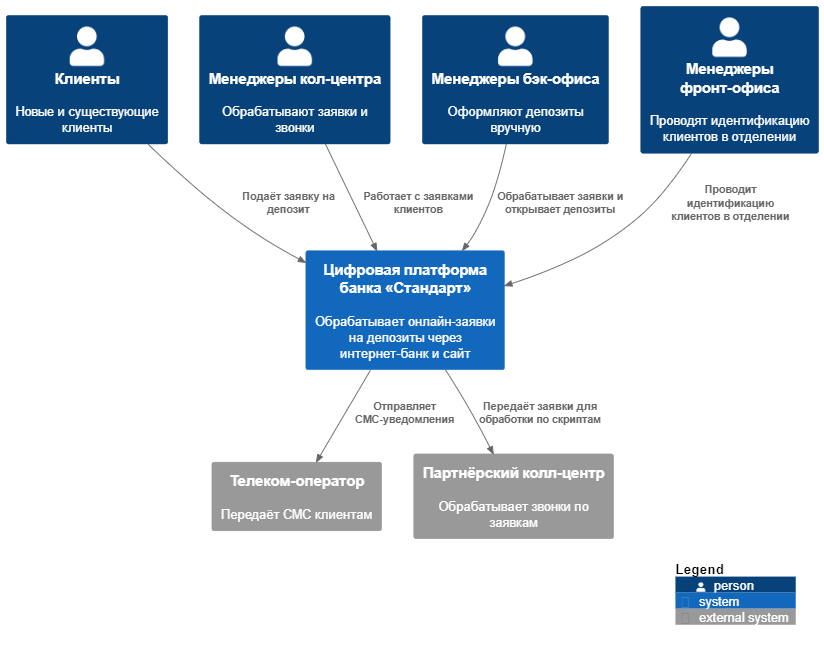
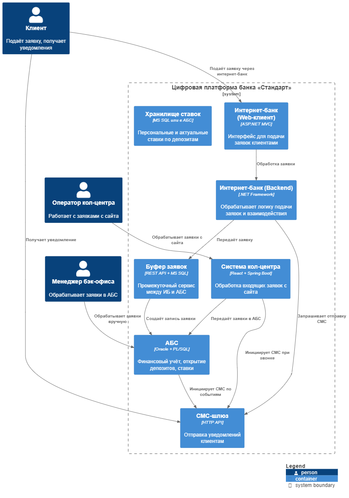


# ADR: MVP открытия депозитов онлайн

### **Контекст**

В рамках цифровой трансформации банка «Стандарт» необходимо реализовать MVP открытия депозитов онлайн — через сайт и интернет-банк. Процесс включает подачу заявки, обработку запроса менеджером и уведомление клиента. Ключевые ограничения — безопасность, отказоустойчивость и минимизация нагрузки на АБС. Существующая ИТ-инфраструктура включает монолитный интернет-банк на .NET, сайт на PHP/React, АБС с базой Oracle и внешние сервисы (СМС-шлюз и телеком-оператор).

### **Функциональные требования (Use Cases)**

| №  | Действующее лицо                 | Use Case                                                                 |
|----|----------------------------------|---------------------------------------------------------------------------|
| 1  | Как клиент (на сайте),           | я хочу оставить ФИО и телефон, чтобы подать заявку на депозит            |
| 2  | Как менеджер кол-центра,         | я хочу получить заявку, чтобы позвонить клиенту и предложить условия     |
| 3  | Как клиент (в интернет-банке),   | я хочу выбрать счёт и сумму, подтвердить заявку через СМС                |
| 4  | Как интернет-банк,               | я хочу отправить заявку в АБС или буфер, чтобы инициировать процесс      |
| 5  | Как менеджер бэк-офиса,          | я хочу обработать заявку в АБС и зафиксировать параметры депозита        |
| 6  | Как АБС и СМС-шлюз,              | я хочу уведомить клиента об открытии депозита и размере ставки           |
| 7  | Как клиент,                      | я хочу прийти в отделение, чтобы пройти идентификацию                    |

### **Нефункциональные и архитектурно-значимые требования**

| №  | Требование                                                                 |
|----|----------------------------------------------------------------------------|
| 1  | Горизонтальное масштабирование интернет-банка                             |
| 2  | Вертикальная масштабируемость АБС (ограничение)                           |
| 3  | 99.9% доступность интернет-банка                                           |
| 4  | TLS-шифрование данных на сайте и в интернет-банке                         |
| 5  | Использование MS SQL и Oracle                                              |
| 6  | Изоляция интернет-банка от АБС — через буфер/очередь                      |
| 7  | Отказ от доработки СМС-модуля подрядчика                                  |

### **Решение**

### Диаграмма контекста (C4 level 1)

📄 *Диаграмма в PlantUML: [`C4_level_1.puml`](C4_level_1.puml)*

### Диаграмма контейнеров (C4 level 2)

📄 *Диаграмма в PlantUML: [`C4_level_2.puml`](C4_level_2.puml)*

### Компоненты и взаимодействие

1. Клиент через интернет-банк подаёт заявку → создаётся запись в промежуточном API → данные поступают в АБС
2. Бэк-офис обрабатывает заявку в АБС вручную
3. Клиент получает СМС через шлюз
4. Заявки с сайта передаются в систему кол-центра, менеджер обзванивает клиента
5. Все передачи данных зашифрованы (TLS)
6. Используются существующие технологии (.NET, Oracle, MS SQL)

### **Объёмы разработки** (что будет разрабатываться или дорабатываться)

### 🔨 Разработка с нуля:
- Форма заявки на сайте (UI и логика отправки)
- Буферный сервис между интернет-банком и АБС
- Хранилище ставок (в перспективе, вместо Excel)
- Внутренняя логика отправки СМС через шлюз (без доработки СМС-модуля подрядчика)

### 🔧 Доработка существующих систем:
- Интернет-банк: интерфейс подачи заявки, СМС-подтверждение
- Система кол-центра: отображение заявок, сценарии обработки
- АБС: доработка под новые типы заявок и событий
- СМС-шлюз: настройка шаблонов уведомлений и вызовов

### 🚫 Используется без изменений:
- СМС-модуль подрядчика (не трогаем)
- Базовая инфраструктура сайта и интернет-банка
- Идентификация клиента в отделении (остаётся офлайн)

### **Альтернативы**

- Прямая интеграция ИБ с АБС (отклонено из-за нагрузки)
- Kafka как брокер сообщений (в перспективе, сейчас не поддерживается .NET-монолитом)

### **Последствия**

- MVP реализуем без изменения СМС-модуля
- Требуется создание или настройка промежуточного API/сервиса
- В перспективе возможен переход интернет-банка на микросервисную архитектуру
