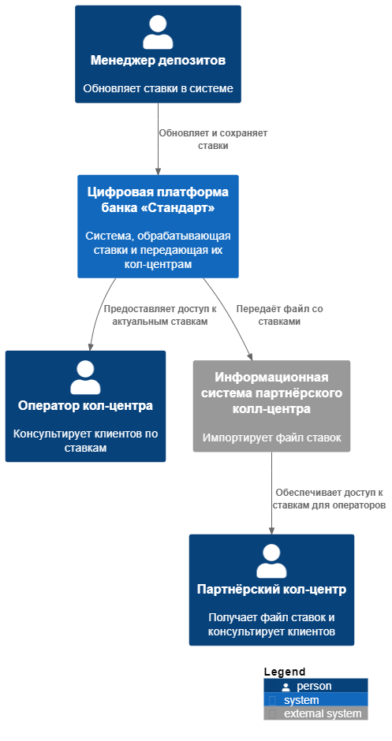
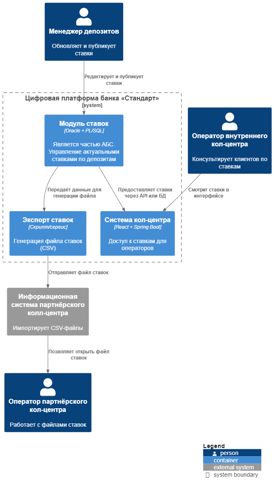

# ADR: Передача ставок в кол-центр

### **Контекст**

С запуском MVP открытия депозитов онлайн, возник риск увеличения нагрузки на кол-центр банка. Возрастные клиенты могут предпочесть уточнить условия депозитов по телефону. 
Чтобы кол-центр мог консультировать по актуальным ставкам, необходимо обеспечить доступ к информации о ставках:
- Внутреннему кол-центру — желательно в режиме, близком к реальному времени.
- Партнёрскому кол-центру — в виде передаваемого файла (например, XLS/CSV), поскольку API-вызовы недоступны.

Ставки по депозитам на данный момент хранятся в Excel-файлах, передаваемых по почте. Предполагается их миграция в цифровой вид в рамках доработки АБС или отдельного сервиса.

---

### **Функциональные требования (Use Cases)**

| № | Действующие лица или системы           | Use Case                                                                 |
|----|----------------------------------------|--------------------------------------------------------------------------|
| 1  | Как оператор внутреннего кол-центра,   | я хочу видеть актуальные ставки в интерфейсе, чтобы консультировать клиента |
| 2  | Как партнёрский кол-центр,            | я хочу регулярно получать файл со ставками, чтобы загрузить его в систему |
| 3  | Как система банка,                    | я хочу генерировать и передавать файл со ставками раз в день             |
| 4  | Как менеджер депозитного направления, | я хочу обновить ставки, чтобы они были доступны всем кол-центрам         |

---

### **Нефункциональные и архитектурно-значимые требования**

| № | Требование                                                                 |
|----|---------------------------------------------------------------------------|
| 1  | Использовать существующую систему хранения ставок (или доработать АБС)   |
| 2  | Обновление ставок должно быть централизовано                             |
| 3  | Для партнёрского кол-центра возможна только передача файла (например, CSV) |
| 4  | Внутренний кол-центр должен получать ставки в интерфейсе без задержек    |
| 5  | Интеграция без изменений в системе партнёра (только импорт файла)        |
| 6  | Учитывать безопасность при передаче файла (контроль доступа, шифрование) |

---

### **Решение**

### Диаграмма контекста (C4 level 1)

📄 *Диаграмма в PlantUML: [`C4_Context_TransferRates.puml`](C4_Context_TransferRates.puml)*

### Диаграмма контейнеров (C4 level 2)

📄 *Диаграмма в PlantUML: [`C4_Containers_TransferRates.puml`](C4_Containers_TransferRates.puml)*

> 💬 *Примечание:* Контейнерная диаграмма фокусируется только на компонентах, которые имеют непосредственное отношение к задаче передачи ставок.  
> Она не отображает всю систему банка целиком, а лишь те её части, которые задействованы в хранении, обновлении и передаче ставок между участниками процесса.

Основное хранилище ставок размещается в рамках АБС или выделенного сервиса ставок. 
Кол-центр получает доступ к этим данным по внутреннему API, либо из общей базы. 
Для партнёрского колл-центра ежедневно выгружается CSV-файл со ставками, доступный по защищённому каналу (например, почта, внутренний портал).

---

### **Альтернативы**

- Прямая интеграция партнёрского кол-центра через API — ❌ недоступна из-за ограничений на стороне партнёра
- Использование XML вместо CSV — возможно, но менее удобно для просмотра и требует дополнительных усилий по обработке
- Рассылка вручную сотрудниками — ❌ ненадёжна, не гарантирует своевременную доставку и актуальность данных

---

### **Недостатки, ограничения, риски**

- Необходим контроль актуальности выгружаемого файла
- Возможна рассинхронизация при изменении ставок в течение дня
- Необходимо настраивать канал передачи (безопасность, автоматизация)
- У партнёрского кол-центра возможны сложности с форматом

---

### **Список задач по системам**

**АБС / Хранилище ставок**
- Централизованное хранилище ставок
- Интерфейс редактирования ставок
- Скрипт/модуль выгрузки ставок в CSV

**Система кол-центра**
- Отображение актуальных ставок
- Интерфейс доступа к ставкам (API или база)

**Передача партнёру**
- Настройка расписания выгрузки файла
- Инфраструктура передачи (например, SFTP, почта)
- Логирование и подтверждение отправки

---

### **RoadMap**
📄 *Отдельная диаграмма в draw.io: [`RoadMap_bank_Standart.drawio`](RoadMap_bank_Standart.drawio)*